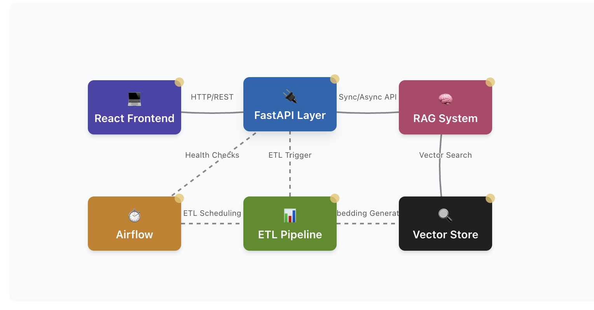

# AI Pipeline Showcase


## Project Overview
This project demonstrates a full-stack AI data pipeline with multi-provider LLM support, including:
- **ETL**: Data ingestion and transformation using DuckDB
- **AI**: LangChain RAG pipeline with OpenAI, Hugging Face, and mock fallbacks
- **Serving**: FastAPI endpoints for triggering workflows
- **Orchestration**: Airflow DAGs for scheduled runs
- **Containerization**: Docker for consistent deployment

It is designed to be lightweight, modular, and deployable locally with minimal configuration while demonstrating production-ready practices.

## Tech Stack
- **Python (3.10+)**: Core language
- **LangChain**: RAG orchestration framework
- **OpenAI & Hugging Face**: LLM providers with fallback chains
- **FastAPI**: API endpoints
- **DuckDB**: Embedded SQL engine
- **FAISS**: Vector search for embeddings
- **Airflow**: Workflow orchestration
- **Docker & Docker Compose**: Containerization

## Architecture



The system follows a modular architecture with these key components:

1. **ETL Module** (`etl/run_etl.py`):
   - Extracts data from sources (simulated for demo)
   - Transforms data with business logic
   - Loads into DuckDB for persistence

2. **Vector Store** (`vectorstore/index_faiss.py`):
   - Creates and manages FAISS vector indexes
   - Enables semantic search over documents

3. **RAG Chain** (`llm/rag_chain.py`):
   - Supports multiple LLM providers (OpenAI, Hugging Face)
   - Implements production-grade fallback chains
   - Features retry mechanisms and error handling
   - Uses embeddings to find relevant context

4. **API Layer** (`app.py`):
   - Provides endpoints for triggering pipelines
   - Handles question answering requests
   - Includes health checks and monitoring

5. **Airflow DAGs** (`airflow_dags/ai_pipeline_dag.py`):
   - Schedules regular ETL runs
   - Updates vector store on schedule
   - Handles both async and sync execution models
   - Includes robust error handling

##### Interactive Architecture Diagram

For an interactive version of the architecture diagram, [click here](https://qpulce-dev.github.io/ai-pipeline-showcase/).

## System Requirements

Before setting up the project, ensure you have the following prerequisites installed:

- **Docker & Docker Compose** (v2+): For containerized deployment
- **Make**: For running Makefile commands
- **Git**: For version control and cloning
- **Python 3.10+**: For local development outside containers
- **Node.js 16+**: For frontend development (optional)
- **curl**: Used by health check scripts
- **At least 4GB RAM**: For running Airflow services

Installation guidance for prerequisites:
- Docker: [https://docs.docker.com/get-docker/](https://docs.docker.com/get-docker/)
- Make: Available via package managers (apt, brew, etc.)
- Git: [https://git-scm.com/downloads](https://git-scm.com/downloads)

## Local Setup
```bash
# 1. Clone the repository
git clone https://github.com/username/ai-pipeline-showcase.git
cd ai-pipeline-showcase

# 2. Run the setup script
make setup

# 3. Edit .env file with your API keys
# - OpenAI API key
# - Hugging Face API token (optional)
# - Model configuration

# 4. Start the services
make start

# 5. Access components:
# - Frontend: http://localhost:3000
# - API Docs: http://localhost:8000/docs
# - Airflow: http://localhost:8081
```

## Quick Demo Commands
```bash
# Run the ETL process
make run-etl

# Initialize the vector store
make init-vectors

# Ask a question to the RAG system
make ask QUESTION="What are the best electronics products?"

# Test with a specific provider
make test-provider PROVIDER=huggingface QUESTION="What are the best clothing products?"

# Switch between model providers
make switch-provider
```

## API Endpoints

| Endpoint | Method | Description |
|----------|--------|-------------|
| `/` | GET | Root endpoint with basic info |
| `/ask` | POST | Ask a question to the RAG system |
| `/etl/run` | POST | Trigger ETL pipeline run |
| `/vector/initialize` | POST | Initialize vector store |
| `/health` | GET | Health check endpoint |

## Multi-Provider LLM Support

This project demonstrates production-ready AI with support for multiple LLM providers:

1. **OpenAI**: High-quality results with API key
2. **Hugging Face**: Open-source alternative with HF token
3. **Mock Mode**: Demo capability without any API keys

The system features a robust fallback chain that gracefully degrades:
```
HuggingFace → OpenAI → Mock
```

Environment variables control the provider selection and configuration:
```
MODEL_PROVIDER=huggingface  # Options: openai, huggingface, mock
HF_EMBEDDING_MODEL=sentence-transformers/all-MiniLM-L6-v2
HF_LLM_MODEL=google/flan-t5-base
```

## Project Structure
```
📦 ai-pipeline-showcase
├── app.py                  # FastAPI entrypoint
├── docker-compose.yaml     # Docker setup
├── Dockerfile              # Main service container
├── Makefile                # Development commands
├── requirements.txt        # Dependencies
├── setup.sh                # Setup script
├── .env                    # Environment variables
├── README.md               # This file
│
├── airflow/                # Airflow configuration
│   ├── dags/               # Airflow DAGs
│   ├── Dockerfile          # Airflow container
│   └── config/             # Airflow settings
│
├── etl/                    # ETL ingestion/transformation
│   └── run_etl.py          # ETL process
│
├── frontend/               # React frontend
│   ├── src/                # Frontend source
│   ├── public/             # Static assets
│   └── Dockerfile          # Frontend container
│
├── llm/                    # RAG implementation
│   └── rag_chain.py        # Multi-provider RAG chain
│
├── vectorstore/            # Vector embeddings
│   └── index_faiss.py      # FAISS setup
│
├── data/                   # Local data storage
│   └── analytics.duckdb    # DuckDB database
│
└── tests/                  # Test suite
    ├── test_app.py         # API tests
    ├── test_etl.py         # ETL tests
    └── test_rag_direct.py  # RAG system tests
```

## Using Makefile Commands

The project includes a comprehensive Makefile with commands for all operations:

### Core Commands
- `make setup` - Initial project setup
- `make start` - Start all services
- `make stop` - Stop all services
- `make status` - Check service status

### Service Management
- `make rebuild SERVICE=api` - Rebuild a specific service
- `make rebuild-airflow` - Rebuild all Airflow services
- `make logs SERVICE=api` - View service logs

### AI Operations
- `make switch-provider` - Switch model provider
- `make check-models` - Check current configuration
- `make run-etl` - Run the ETL process
- `make init-vectors` - Initialize vector store
- `make ask QUESTION="What are the best products?"` - Ask a question

### Airflow Management
- `make trigger-dag DAG_ID=ai_pipeline` - Trigger Airflow DAG
- `make sync-dag` - Update Airflow DAG files

### Troubleshooting
- `make health` - Check API health
- `make debug` - Run diagnostics
- `make fix` - Fix common issues

## Production-Ready Features

This showcase demonstrates several production-grade practices:

1. **Robust Error Handling**:
   - Retry mechanisms with exponential backoff
   - Comprehensive logging
   - Graceful degradation

2. **Provider Fallback Chains**:
   - Automatic fallback between providers
   - Configuration validation
   - Flexible deployment options

3. **Operational Excellence**:
   - Health checks and monitoring
   - Docker orchestration
   - Comprehensive test suite

4. **Performance Optimization**:
   - Vector store caching
   - Efficient database operations
   - Asynchronous API endpoints

## Running Tests
```bash
# Run all tests
pytest

# Run specific test categories
pytest tests/test_app.py
pytest tests/test_etl.py

# With coverage report
pytest --cov=.
```

## Extending the Project

### Adding New Data Sources
1. Update `etl/run_etl.py` to add a new source
2. Implement extraction logic in `extract_data()`
3. Add any necessary transformations
4. Register your source in the ETL process function

Example for adding a CSV source:
```python
# In etl/run_etl.py
async def extract_data(source: str) -> pd.DataFrame:
    if source == "sample":
        # Existing sample data generation
        ...
    elif source == "csv":
        # New CSV source implementation
        df = pd.read_csv("path/to/your/data.csv")
        return df
    else:
        raise ValueError(f"Unknown data source: {source}")
```

### Customizing LLM Providers
1. Modify `llm/rag_chain.py` to add a new provider
2. Update the fallback chain
3. Add configuration in docker-compose.yaml

Example for adding a new provider:
```python
# In llm/rag_chain.py in get_llm() function
if MODEL_PROVIDER == "new_provider":
    logger.info(f"Attempting to use New Provider LLM")
    try:
        from new_provider_library import NewProviderLLM
        return NewProviderLLM(
            api_key=os.getenv("NEW_PROVIDER_API_KEY"),
            model_name=os.getenv("NEW_PROVIDER_MODEL", "default-model")
        )
    except Exception as e:
        logger.warning(f"Failed to initialize New Provider LLM: {str(e)}")
```

### Scaling with Additional Services
1. Add new services to docker-compose.yaml
2. Implement API endpoints in app.py
3. Update Airflow DAGs for orchestration

Example for adding a new service:
```yaml
# In docker-compose.yaml
services:
  # Existing services...

  new-service:
    build:
      context: ./new-service
      dockerfile: Dockerfile
    ports:
      - "8888:8888"
    volumes:
      - ./new-service:/app
    depends_on:
      - api
    environment:
      - API_URL=http://api:8000
    networks:
      - ai_pipeline_network
```

## Troubleshooting

### API Issues
- Check logs with `make logs SERVICE=api`
- Verify API keys in .env file
- Ensure database file exists with `make run-etl`
- Check if Docker can access required ports with `make debug`

### Airflow Issues
- Check logs with `make logs SERVICE=airflow-scheduler`
- Verify DAG path with `make sync-dag`
- Check for import errors with `make list-errors`
- If DAGs fail, try rebuilding with `make rebuild-airflow`

### Model Provider Issues
- Verify tokens in .env file
- Switch providers with `make switch-provider`
- Test directly with `make test-provider`
- For Hugging Face issues, check if models are available on Hugging Face Hub

### System Requirements Issues
- Insufficient memory: Ensure at least 4GB RAM is available
- Port conflicts: Check if ports 8000, 8081, 3000, 5433 are available
- Permission issues: Run `chmod -R 777 data vectorstore` or `make fix`
- Network issues: May need to adjust Docker network settings with `make debug`

## Credits
Maintained by Queanu Pulce — AI infrastructure, automation, and full-stack engineer.

**Ready to make data pipelines beautiful, useful, and smart.**
